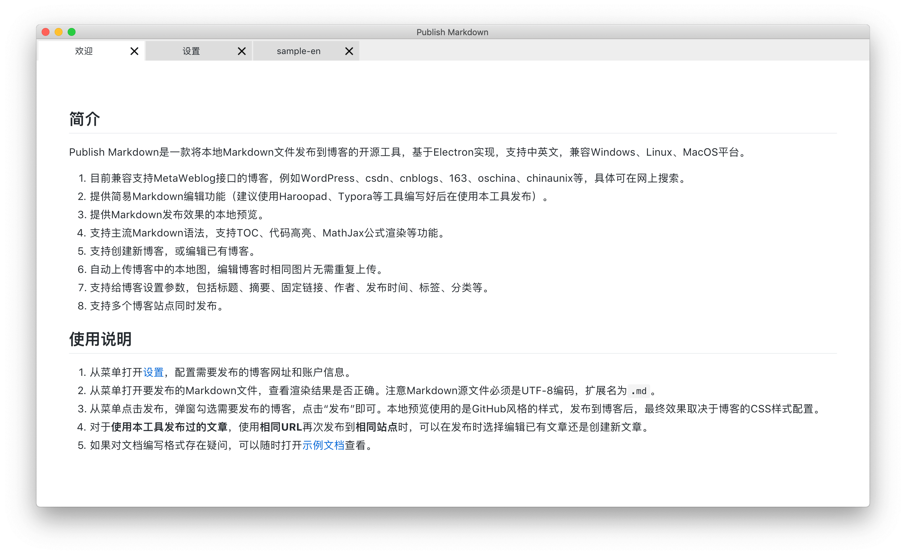
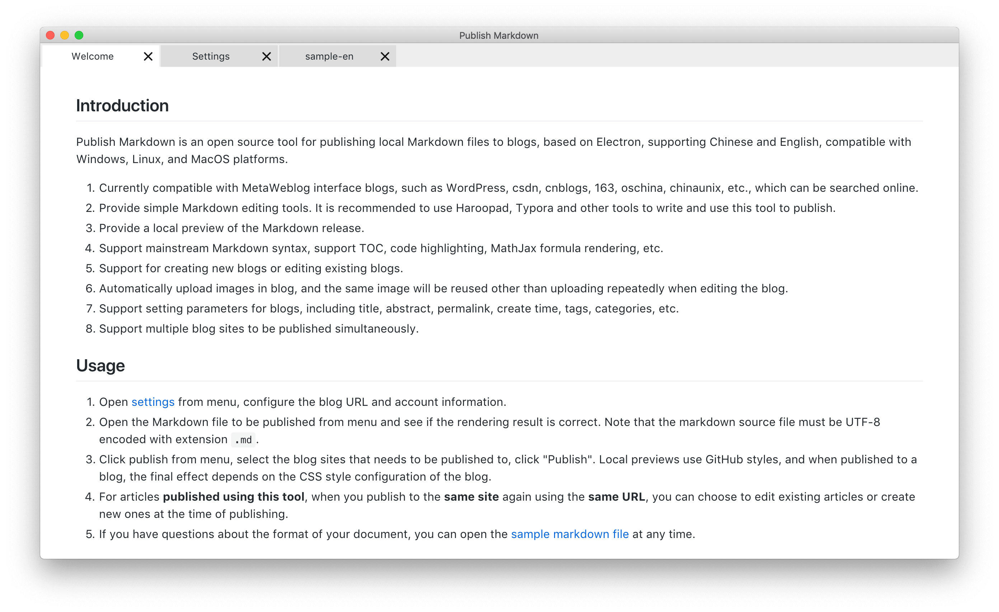
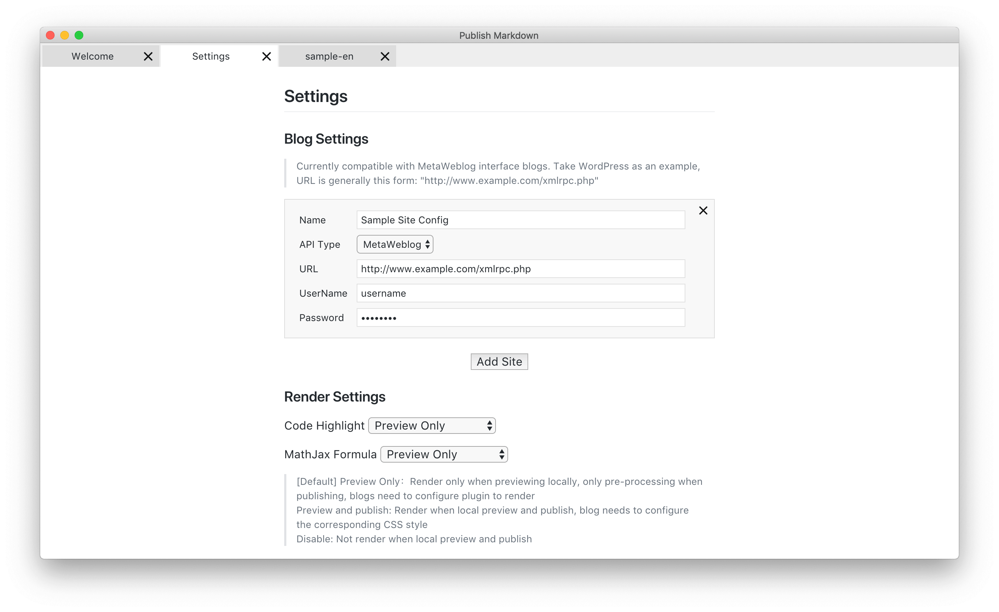
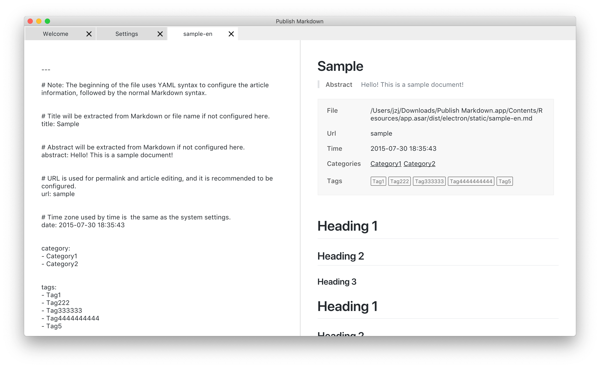
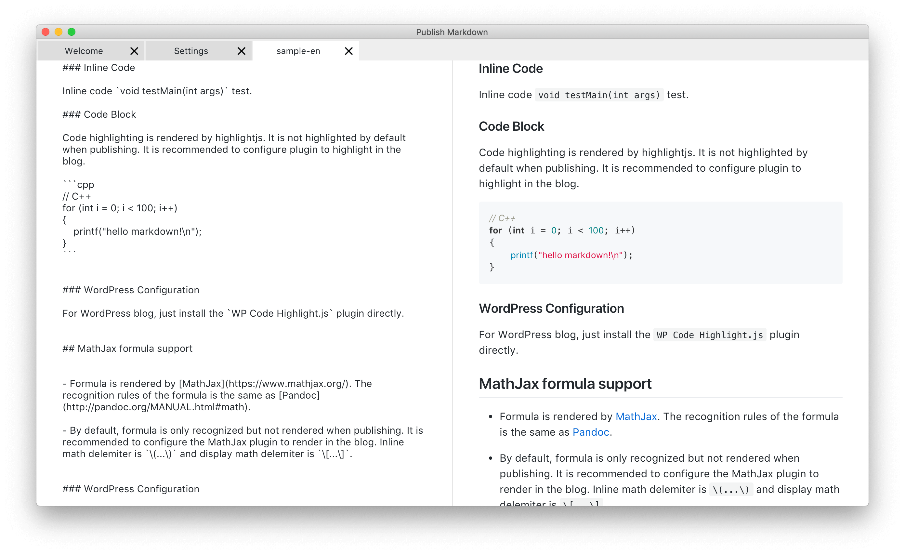
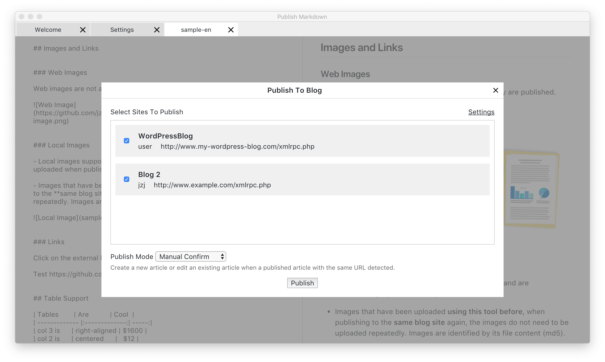

# Publish Markdown

[English](#) [简体中文](README.md)

## Introduction

Publish Markdown is an open source tool for publishing local markdown files to blogs, based on electron, supporting Chinese and English, compatible with Windows, Linux, and MacOS platforms.

1. Currently compatible with MetaWeblog interface blogs, such as WordPress, csdn, cnblogs, 163, oschina, chinaunix, etc., which can be searched online.
1. Provide simple Markdown editing tools. It is recommended to use Haroopad, Typora and other tools to write and use this tool to publish.
1. Provide a local preview of the Markdown release.
1. Support mainstream Markdown syntax, support TOC, code highlighting, MathJax formula rendering, etc.
1. Support for creating new blogs or editing existing blogs.
1. Automatically upload images in blog, and the same image will be reused other than uploading repeatedly when editing the blog.
1. Support setting parameters for blogs, including title, abstract, permalink, create time, tags, categories, etc.
1. Support multiple blog sites to be published simultaneously.

## Usage

After [downloading](https://github.com/jzj1993/PublishMarkdown/releases) and installing, please see the welcome page for details.

## Related Articles

[WordPress+Markdown+为知笔记，实现高质量笔记和博客](http://www.paincker.com/wp-markdown-wiz-blog)

## ChangeLog

[ChangeLog](docs/CHANGELOG.md)

## Contributing

[Pull requests](https://github.com/jzj1993/PublishMarkdown/pulls) and stars are always welcome. For bugs and feature requests, please create an [issue](https://github.com/jzj1993/PublishMarkdown/issues).

This project is build on [electron-vue](https://github.com/SimulatedGREG/electron-vue).

Setting up the environment:

```bash
git clone git@github.com:jzj1993/PublishMarkdown.git
cd PublishMarkdown
yarn
yarn dev
```

## Screenshots








